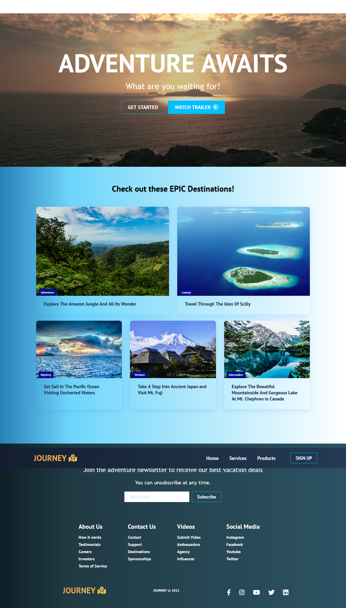
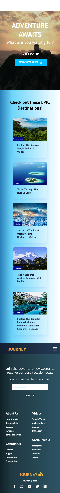
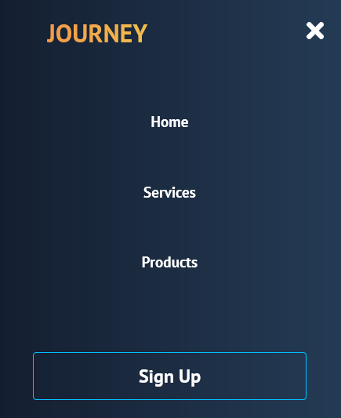

<h1>JOURNEY :world_map:</h1>

<h2>A travel website styled using css in React. </h2>

This website is responsive using flexbox, grid, and CSS custom properties. I had a fun creating this. I used the project of the TRVL website from the tutorial of Brian Design as the skeleton to this project and updated the images, text, and videos along with fixing the issue with the mobile where the video goes past the footer. Screenshots of what the website looks like desktop and mobile along with the sidebar in mobile. Not sure why the navbar doesn't show up on the screenshot so I took a separate screenshot of what the navbar looks like on desktop and mobile.

### Link

- Live Site: [JOURNEY Website](https://travel-website-journey.netlify.app/)

### Screenshots

